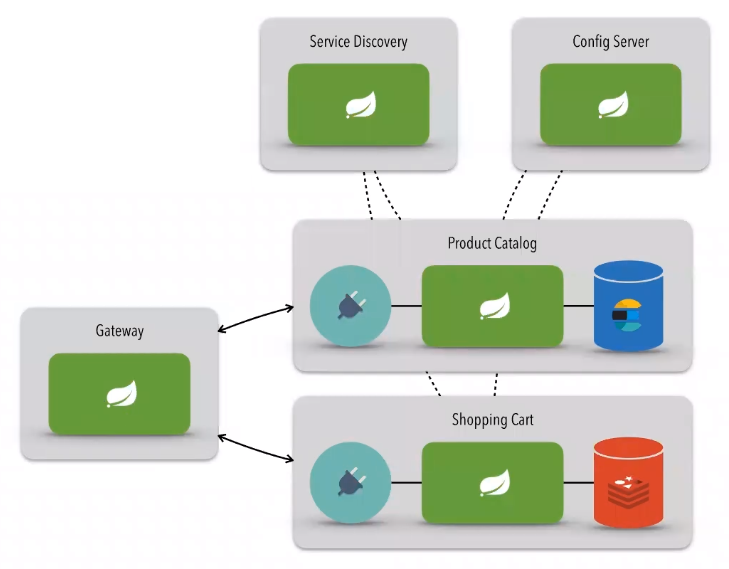

# dio-spring-ecommerce-microservices

Repository with all microservices configurations: https://github.com/axell-brendow/dio-spring-ecommerce-microservices-config

## Running the microservices

There is an order which the microservices should be run:

- [config-server](https://github.com/axell-brendow/dio-spring-ecommerce-microservices/blob/master/config-server/README.md)
- [service-discovery](https://github.com/axell-brendow/dio-spring-ecommerce-microservices/blob/master/service-discovery/README.md)
- [gateway](https://github.com/axell-brendow/dio-spring-ecommerce-microservices/blob/master/gateway/README.md)
- [product-catalog](https://github.com/axell-brendow/dio-spring-ecommerce-microservices/blob/master/product-catalog/README.md) and [shopping-cart](https://github.com/axell-brendow/dio-spring-ecommerce-microservices/blob/master/shopping-cart/README.md)

Check each microservice README!
